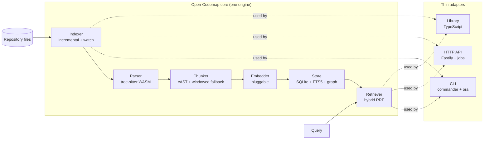

# Open-Codemap

> Local-first, open-source codebase indexer + retriever — usable as a TypeScript library, a CLI, and an HTTP API.

Open-Codemap parses **any** repository with tree-sitter, chunks it into
structurally-coherent units (functions, classes, methods), embeds it with a swappable
embedder, stores everything in a single portable SQLite file per workspace, and answers
queries through **hybrid** retrieval (vector ⊕ BM25 ⊕ graph), fused via Reciprocal Rank
Fusion (RRF).

## Why

AI coding assistants are only as good as the code they can _find_. Generic "dump the repo
into a prompt" approaches lose structure and drown on large codebases. Open-Codemap gives
you precise, ranked code locations — combining **meaning** (embeddings), **exact
identifiers** (BM25), and **code-structure relationships** (an import/call graph) — so a
retrieval call returns the _right_ function, not a fuzzy blob.

It is local-first and open-source (MIT): one core engine, exposed three ways (library,
CLI, HTTP API), with no lock-in to a paid embedding provider.

## Quickstart

```bash
pnpm install
pnpm build

# Build an index of any repo (uses the deterministic mock embedder — no API key needed).
node dist/cli/index.js index ./my-repo --embedder mock

# Ask an identifier question (exact name match via BM25).
node dist/cli/index.js query ./my-repo "getAuthToken" --json

# Ask a plain-English question (semantic via vector).
node dist/cli/index.js query ./my-repo "where do we validate login" --json

# List indexed workspaces.
node dist/cli/index.js list ./my-repo

# Start the HTTP API.
node dist/cli/index.js serve ./my-repo --embedder mock
```

A ready-made sample lives in [`examples/sample-repo`](./examples/sample-repo):

```bash
node dist/cli/index.js index examples/sample-repo --embedder mock
node dist/cli/index.js query examples/sample-repo "where do we validate login" --json
```

## Architecture



- **Parser** — [`web-tree-sitter`](https://www.npmjs.com/package/web-tree-sitter) with
  prebuilt grammar `.wasm` from
  [`tree-sitter-wasm`](https://www.npmjs.com/package/tree-sitter-wasm) (covers the v1
  set: JavaScript, TypeScript/TSX, Python, Go, Rust, Java, C, C++, C#, Ruby, plus ~140
  more). Unsupported/unparseable files fall back to a sliding-window chunker.
- **Chunker** — cAST-style recursive chunking: one chunk per top-level
  function/class/method, recursively split when over the token budget, with a
  sliding-window fallback for plain text.
- **Embedder** — pluggable interface (`mock` / `voyage` / `jina`). The **mock**
  `HashEmbedder` is deterministic and needs no network or API key — it powers the test
  suite and quickstart.
- **Store** — one portable SQLite file per workspace. Relational tables
  (`chunks`, `symbols`, `edges`, `manifest`) + **FTS5** for BM25 + JS-computed cosine KNN
  over stored embeddings. The `Store` interface isolates the storage backend so a native
  `sqlite-vec`/`vec0` engine can be swapped in later.
- **Indexer** — walks files honoring `.gitignore`, hashes each, and re-embeds **only
  changed chunks** (incremental). Moved/renamed code is fixed up by `contentHash`
  without re-embedding. Optional `--watch` mode keeps the index live.
- **Retriever** — hybrid vector ⊕ BM25 ⊕ graph, fused with RRF (k=60). Optional
  `expandGraph` pulls in a chunk's import/call neighbors. Degrades gracefully to
  BM25+graph if the embedder fails.

## Library usage

```ts
import {
  Indexer,
  Retriever,
  SqliteStore,
  WorkspaceRegistry,
  HashEmbedder,
  TreeSitterParser,
} from 'open-codemap';

const embedder = new HashEmbedder(1024); // swap for VoyageEmbedder / JinaEmbedder
const parser = new TreeSitterParser();
const registry = new WorkspaceRegistry();

const indexer = new Indexer({ embedder, parser, registry });
await indexer.index('./my-repo'); // builds .codemap/<repo>.sqlite

const store = await registry.open('./my-repo', { dims: embedder.dims });
const retriever = new Retriever({ store, embedder });

const results = await retriever.retrieve({
  text: 'where do we validate login',
  topK: 5,
  expandGraph: true,
});
for (const r of results) {
  console.log(`${r.score.toFixed(3)} [${r.mode}] ${r.chunk.file}:${r.chunk.symbol}`);
}
```

## Embedder configuration

The default embedder is **Voyage `code-3`** (`voyage-code-3`, 1024-dim, code-tuned). Set
the key via env var or flag:

```bash
export VOYAGE_AI_API_KEY=...
node dist/cli/index.js index ./my-repo --embedder voyage
```

| Kind     | Model                | Env var             | Notes                                        |
| -------- | -------------------- | ------------------- | -------------------------------------------- |
| `mock`   | `HashEmbedder`       | —                   | Deterministic, no network/key. Tests + demo. |
| `voyage` | `voyage-code-3`      | `VOYAGE_AI_API_KEY` | Default paid backend (code-tuned, 32K ctx).  |
| `jina`   | `jina-embeddings-v3` | `JINA_API_KEY`      | OSS-friendly fallback.                       |

> **Switching embedder dims requires re-indexing.** If you change the embedding width
> (e.g. swap Voyage for an OSS model with different dims), pass `--rebuild` (or
> `reindex: true` in the library) to drop and recreate the index. The engine enforces
> dim-consistency so KNN distances stay meaningful.

## HTTP API

```bash
node dist/cli/index.js serve ./my-repo --embedder mock --port 8787
```

| Method | Path          | Body                                                       | Description                                         |
| ------ | ------------- | ---------------------------------------------------------- | --------------------------------------------------- |
| POST   | `/index`      | `{ repo, embedder?, reindex? }`                            | Starts a background index job; returns `{ jobId }`. |
| GET    | `/jobs/:id`   | —                                                          | Poll job status / progress / result.                |
| POST   | `/query`      | `{ repo, text, topK?, expandGraph?, filters?, embedder? }` | Synchronous hybrid retrieval.                       |
| GET    | `/workspaces` | —                                                          | List indexed workspaces.                            |

> **`POST /query`** — Pass `repo` (required) to select which indexed workspace to query.
> All other body fields are optional.

## Scripts

| Script           | Purpose                                   |
| ---------------- | ----------------------------------------- |
| `pnpm build`     | Bundle `index` / `cli` / `api` with tsup. |
| `pnpm typecheck` | `tsc --noEmit` (strict).                  |
| `pnpm lint`      | ESLint (flat config) + Prettier.          |
| `pnpm test`      | Vitest unit + integration + e2e.          |

## Limits & open questions

1. **Storage backend is Node's built-in `node:sqlite` (Node 22+) + JS KNN** (not native
   `sqlite-vec`). The `Store` interface isolates this; a native `vec0` backend is a later
   swap. Hybrid retrieval behavior is unchanged. Requires Node ≥ 22.5 (see `engines` in
   `package.json`).
2. **Embedder dims consistency** — index + query embedders must share `dims`; switching
   requires `--rebuild`.
3. **Graph precision** — v1 ships the import graph + a best-effort call graph from
   tree-sitter symbol queries. Precise call graphs (across files/overloads) are deferred
   to an optional LSP/SCIP pass.
4. **Reranker** — RRF-only for MVP; a pluggable `Reranker` hook ships but is optional.
5. **No C/C++ compiler on some environments** — the WASM tree-sitter choice (plus Node's
   built-in `node:sqlite`) means Open-Codemap builds and runs with zero native compilation.

## License

MIT
